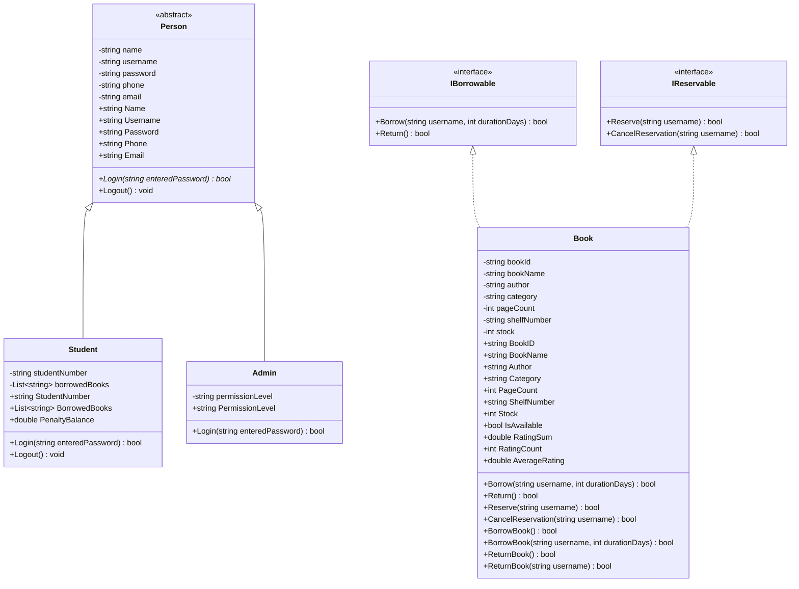
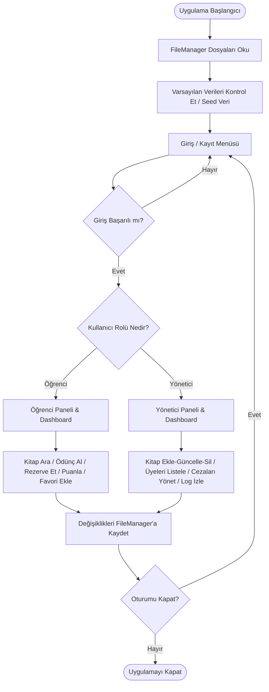

# Gelişmiş Kütüphane Otomasyonu Sistemi (Konsol Arayüzü)

Bu proje, Nesne Tabanlı Programlama (OOP) prensiplerini ve katmanlı mimari mantığını güçlü bir şekilde göstermek amacıyla C# dilinde geliştirilmiş akademik düzeyde bir **Gelişmiş Kütüphane Otomasyonu Sistemi**'dir. Kullanıcı arayüzü olarak tamamen **Konsol CLI (Command Line Interface)** tabanlıdır ve verilerini `.txt` dosyalarında saklayan özel bir dosya veritabanı yönetim katmanına sahiptir.

---

## 🚀 Proje Kurulumu ve Çalıştırma

### Gereksinimler
- .NET 10.0 SDK veya üzeri
- Herhangi bir C# IDE'si (Visual Studio 2022, VS Code veya Rider) veya .NET CLI yüklü bir terminal.

### Çalıştırma Adımları
1. Projenin ana klasörüne gidin:
   ```bash
   cd "Final Kütüphane Projesi"
   ```
2. Projeyi derleyin ve çalıştırın:
   ```bash
   dotnet run
   ```
3. Program ilk açıldığında otomatik olarak **örnek verileri** (`bin/Debug/net10.0/Data/` klasörü altına) yükleyecektir. Test etmek için aşağıdaki varsayılan hesapları kullanabilirsiniz:

#### Varsayılan Giriş Bilgileri:
* 🔑 **Yönetici (Admin) Hesabı:**
  * **Kullanıcı Adı:** `admin`
  * **Şifre:** `admin123`
* 🎓 **Öğrenci Hesabı:**
  * **Kullanıcı Adı:** `ahmet`
  * **Şifre:** `ahmet123`

---

## 📂 Katmanlı Mimari Klasör Yapısı

Proje, akademik ve profesyonel standartlara uygun olarak şu klasör yapısına göre düzenlenmiştir:

- **Interfaces**: İşlevsel sözleşmelerin tanımlandığı yer (`IBorrowable`, `IReservable`).
- **Models**: Veri modelleri, soyut taban sınıf (`Person`) ve kalıtım alan sınıflar (`Student`, `Admin`, `Book`).
- **Managers**: Kütüphane iş kurallarını (iş mantığı) yöneten ana kontrolör (`LibraryManager`).
- **Services**: Veritabanı dosya okuma/yazma işlemlerini yapan `FileManager` ve loglama servisi `LoggerService`.
- **Utilities**: Şifreleme (`SecurityHelper`) ve aktif oturum yönetimi (`SessionManager`).
- **ConsoleUI**: Konsol arayüzünü yöneten sınıf (`ConsoleApp`) ve işletim sistemi uyumluluk sarmalayıcısı (`Console`).
- **Data**: Kütüphane verilerinin düz metin olarak tutulduğu dizin (`kullanıcılar.txt`, `kitaplar.txt` vb.).
- **Logs**: Sistem işlemlerinin anlık olarak loglandığı dizin (`kayıtlar.txt`).

---

## 🛠️ Nesne Tabanlı Programlama (OOP) Yapısı

Projede uygulanan zorunlu OOP prensipleri ve bunların kod içerisindeki karşılıkları:

1. **Soyutlama (Abstraction) & Soyut Sınıflar (Abstract Class):**
   - [Person.cs](file:///c:/Users/omera/source/repos/Final%20K%C3%BCt%C3%BCphane%20Projesi/Final%20K%C3%BCt%C3%BCphane%20Projesi/Models/Person.cs) sınıfı `abstract` olarak tanımlanmıştır. Doğrudan örneği oluşturulamaz, kütüphanedeki tüm kişilerin ortak şablonudur.
2. **Kalıtım (Inheritance):**
   - `Student` ve `Admin` sınıfları `Person` sınıfından türetilmiştir (`class Student : Person`). Üst sınıfın özellik ve metotlarını miras alırlar.
3. **Kapsülleme (Encapsulation):**
   - Sınıflardaki tüm alanlar (fields) `private` yapılmış ve bunlara erişim, veri doğrulaması içeren `public` özellikler (properties) ile sağlanmıştır (Örn: `Book.Stock` negatif değer alamaz, `Book.PageCount` 0 veya negatif olamaz).
4. **Çok Biçimlilik (Polymorphism):**
   - `Person` sınıfındaki `abstract bool Login(...)` metodu, `Student` ve `Admin` sınıflarında kendi yetkilendirme kurallarına göre ezilmiştir (`override`).
5. **Interface (Arayüz) Kullanımı:**
   - [IBorrowable.cs](file:///c:/Users/omera/source/repos/Final%20K%C3%BCt%C3%BCphane%20Projesi/Final%20K%C3%BCt%C3%BCphane%20Projesi/Interfaces/IBorrowable.cs) ve [IReservable.cs](file:///c:/Users/omera/source/repos/Final%20K%C3%BCt%C3%BCphane%20Projesi/Final%20K%C3%BCt%C3%BCphane%20Projesi/Interfaces/IReservable.cs) arayüzleri tanımlanmış ve [Book.cs](file:///c:/Users/omera/source/repos/Final%20K%C3%BCt%C3%BCphane%20Projesi/Final%20K%C3%BCt%C3%BCphane%20Projesi/Models/Book.cs) sınıfına uygulanmıştır.
6. **Yapıcı Metotlar (Constructor):**
   - Tüm sınıflarda anlamlı nesneler üretmek için yapıcı metotlar kullanılmış, türetilen sınıflar `base(...)` anahtar kelimesiyle üst sınıfın yapıcı metodunu tetiklemiştir.
7. **Static Yapılar (Static Classes & Members):**
   - Şifreleme işlemlerini yapan `SecurityHelper` ve aktif kullanıcı bilgisini taşıyan `SessionManager` `static` olarak tasarlanmıştır.
8. **Metot Aşırı Yükleme (Method Overloading):**
   - `Book` sınıfında `BorrowBook()` ve `ReturnBook()` metotlarının farklı parametre alan aşırı yüklemeleri bulunmaktadır.
   - `LibraryManager` sınıfında `SearchBooks(query)` ve `SearchBooks(query, category)` metotları aşırı yüklenmiştir.
9. **Generic List Kullanımı:**
   - `LibraryManager` içerisinde tüm veriler `List<Book>`, `List<Person>`, `List<BorrowRecord>` gibi generic koleksiyonlarda tutulur.
10. **Hata Yönetimi (Exception Handling):**
    - Flat file veri tabanındaki okuma/yazma işlemlerinde, kullanıcı girişlerinde ve kural ihlallerinde `try-catch` blokları kullanılarak uygulamanın çökmesi engellenmiştir.
11. **SOLID Prensipleri:**
    - **Single Responsibility (SRP):** Her sınıfın tek bir işi vardır (Örn: `FileManager` sadece dosya işlerini yapar).
    - **Interface Segregation (ISP):** Ödünç alma ve rezervasyon yetenekleri `IBorrowable` ve `IReservable` olarak ayrıştırılmıştır.

---

## 📊 Sınıf Diyagramı (Class Diagram)



---

## 📈 Akış Diyagramı (Flowchart)



---

## 📋 Örnek Senaryolar (Usage Scenarios)

### Senaryo 1: Stokta Olmayan Kitabın Rezervasyonu ve Bildirim Tetiklenmesi
1. **Öğrenci Girişi:** Öğrenci `ahmet` sisteme giriş yapar.
2. **Katalog Arama:** Kitap kataloğunda "Simyacı" kitabını aratır (Stok değeri: 0).
3. **Rezervasyon:** Kitap stokta olmadığı için doğrudan ödünç alınamaz. Öğrenci "Rezerve Et" butonuna basarak kitabı kendi adına rezerve eder.
4. **Yönetici Girişi:** `ahmet` çıkış yapar. Yönetici `admin` sisteme girer.
5. **Stok Güncelleme:** Yönetici "Kitap Yönetimi" sekmesinden "Simyacı" kitabını seçer, stok miktarını `2` olarak günceller.
6. **Bildirim:** Sistem otomatik olarak rezerve eden en eski kullanıcı olan `ahmet` için `bildirimler.txt` dosyasına "Rezerve ettiğiniz 'Simyacı' kitabı stoklarımıza gelmiştir..." mesajını yazar.
7. **Öğrenci Kontrolü:** `ahmet` tekrar giriş yaptığında ekranındaki "Yeni Bildirim" kartı sarıya döner ve bildirim kutusunda bu uyarıyı görür.

### Senaryo 2: Geciken Kitap ve Ceza Süreci
1. Öğrenci bir kitap ödünç alır (Örn: teslim tarihi bugünden 14 gün sonrasıdır).
2. Sistem açıldığında `LibraryManager.UpdateOverduePenalties()` metodu aktif ödünçleri tarar.
3. Teslim tarihi geçmiş ödünçler tespit edilirse, geciken her gün için `5 TL` ceza hesaplanır.
4. Bu ceza kaydı `dusen.txt` dosyasına kaydedilir ve öğrencinin kütüphanedeki ceza bakiyesine yansıtılır.
5. Öğrenci ceza bakiyesi 0 TL'den fazla olduğu sürece kütüphaneden **yeni kitap ödünç alamaz**.
6. Öğrenci Dashboard panelinden cezasını ödediğinde bakiye sıfırlanır ve sistemden tekrar kitap alabilir.
